Many full-time CCEMS employees assist in teaching both public and EMS
education courses. This extra duty work should be paid at a rate that is
commiserate with the market rate for instructors in these disciplines.
However, CCEMS employee pay rates are based on their credential rank,
position, EMS experience, and tenure within the organization. While
these pay rates are appropriately set for EMS field roles, they reflect
neither the type of teaching being done nor the employee’s experience
and competence as an instructor. Furthermore, the wide variation in
employee pay rates and interchangeability of specific instructors
substantially complicates budgeting for labor costs involved in offering
these courses.

Setting extra duty job rates specific to the types of instruction
remedies this problem. Most of this work is done as overtime, and labor
laws require paying *blended overtime* when an employee has multiple pay
rates.

Blended overtime is calculated as a weighted average of the wages
worked. For example, employee A is employed full-time as a P2 paramedic
getting paid $30/hr and helps out teaching EMT skills for $25/hr.
Employee A works two 24 hours shifts as a paramedic (totaling 48 hours )
and then teaches for 4 hours. This totals 52 hours. The employee is paid
$1,440 for their field shifts and $100 for their teaching time, totaling
$1,540. Overtime premium is calculated based on the blended, or
weighted, pay rate. The blended pay rate is calculated by dividing the
total hours worked, 52, by the total pay, $1,540, resulting in a
weighted average rate of $29.62/hr. Overtime premium is 0.5 times this
pay rate, equaling $14.81/hr. Overtime pay is the base pay rate plus the
overtime premium. For Employee A, overtime worked in the field would be
paid $44.81/hr and overtime worked teaching would be paid $39.81.

This document outlines the process and findings for target pay rates
based on market analysis as well as a process for determining fair and
reasonable CCEMS pay rates. These rates are determined based on the
market analysis and on calculating the effects of blended overtime. The
objective is to set a base pay rate for specific types of instructional
work that, when combined with blended overtime, will result in an
effective pay rate that is close to the target pay rates. This
determination is balanced by ensuring that straight pay (when employee
doesn’t teach in overtime) is still reasonably fair.

## Teaching Positions and Target Pay Rates

We propose four types of teaching positions:

### CPR Instructor

Responsible for teaching CPR, AED, and First Aid courses (including
Wilderness First Aid). Requires CPR instructor certification. Market pay
rates vary widely, but appear to generally be $15-20/hour in the Houston
market.

**Target pay rate for CPR Instructor:** $20 /hr.

### CE Instructor

Responsible for teaching continuing education courses, including
standardized “card courses” from AHA and NAEMT, such as ACLS, ACLS-EP,
AMLS, PHTLS, and PEPP. Typically requires EMT or Paramedic certification
along with course-specific instructor certification. Market pay rates
are typically $16-20/hour, depending on type of course and experience.

**Target pay rate for CE Instructor:** $25 /hr.

### EMT Skills Instructor

Responsible for teaching lab skills and scenarios for EMT Basic courses.
Requires a minimum of an EMT-Basic certification. Skills instructors are
provided with lesson plans, skill sheets, and background information.
Market pay rates vary more widely for this role, but seem to range from
$18-25/hour, with most positions paying at the lower end of this range.

**Target pay rate for EMT Skills Instructor:** $25/hr.

### Paramedic Skills Instructor

Similar to an EMT skills instructor, but with responsibility for
teaching more complex skills and scenarios. Requires a minimum of an
EMT-Paramedic certification. Market pay rates are $22-25/hour.

**Target pay rate for Paramedic Skills Instructor:** $30 /hr.

### Adjunct Faculty

Responsible for planning, developing, and teaching EMS classes in a
given curriculum. This includes:

-   Preparing for and delivering lectures for EMT and Paramedic courses.

-   Planning and independently running EMT and paramedic class sessions
    (4 to 8 hours).

-   Coordinating “Card courses” (requires course-specific Course
    Coordinator certification).

Market pay rates vary but some price points include $20, $31, and at the
high end, $47.66/hr.

**Target pay rate for Adjunct Faculty**: $38 /hr.

## Pay Rate Analysis (Using Cumulative Overtime)

The effective pay rate (factoring in blended overtime) is calculated
based on the past year’s worth of actual work performed by current
instructors along with their current base pay rates. Existing schedule
reporting doesn’t allow for filtering out what teaching hours were CPR,
EMT skills instruction, or faculty lecturing. Therefore, effective pay
rates were determined by simulating all teaching hours paid out at that
specific rate, for instructors who teach at that level.

The historical schedule data includes 4,892 shifts for 30 instructors in
the date range 04/14/2020 through 04/14/2021. The typical employee
averaged 3 field shifts and 1 teaching assignment per week, with a
median of 48 hours (IQR 48 - 48) in the field and 4 hours (IQR 1 - 7)
teaching each week. As can be seen in the graph below, two employees had
median weekly education hours above 20 due to light duty assignments
coded to Education. For the sake of average analysis, these outliers
were excluded.

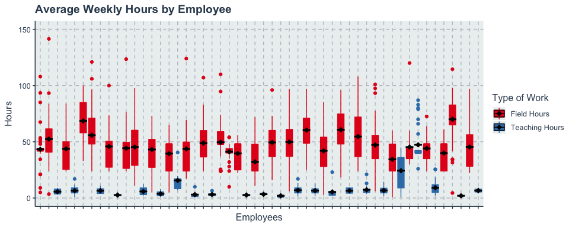

Overtime hours were calculated as the any hours worked after the first
forty hours in a week. Depending on when in the week the employee
taught, that resulted in different allocations of overtime to field or
teaching. As can be seen below, teaching hours rarely resulted in
overtime pay. This is not unexpected; a typical employee might work one
24 hour shift on a Sunday or Monday, and then not work their next shift
until Thursday or Friday. Since classes are almost always on weekdays,
this would put almost all teaching assignments before the employee hits
40 hours in the week.

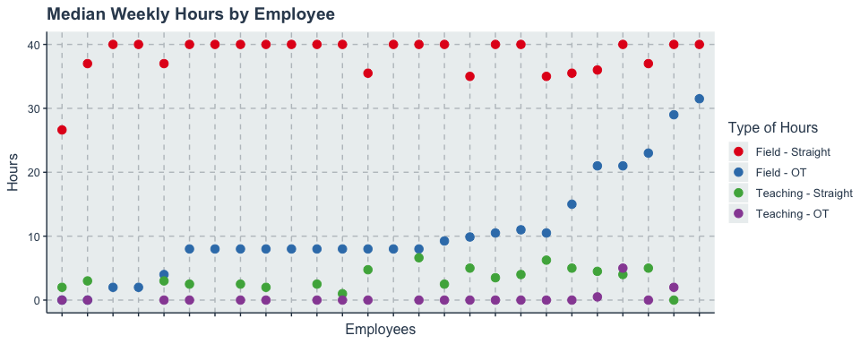

Pay is then analyzed for each employee and effective payrates are
determined by including the effects of blended overtime.

### CPR Instructor

**Target pay rate for CPR Instructor:** $20 /hr.
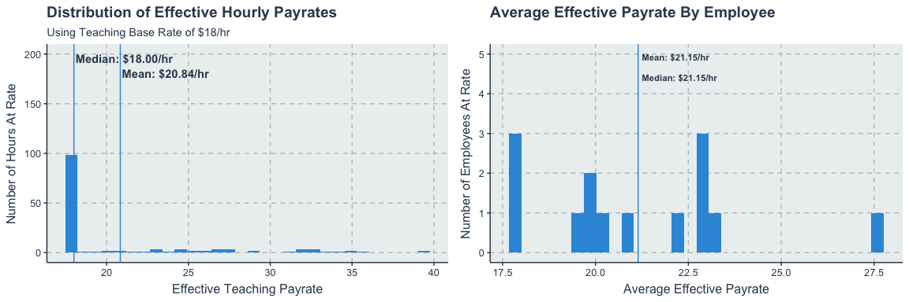

### CE Instructor

**Target pay rate for CE Instructor:** $25 /hr.
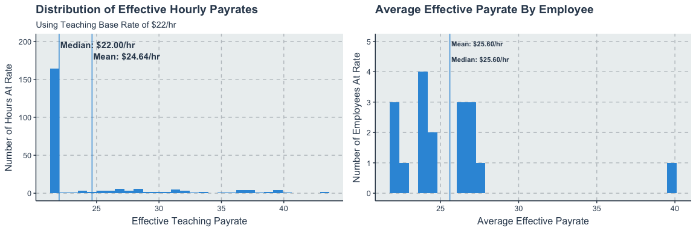 ##\# EMT
Skills Instructor **Target pay rate for EMT Skills Instructor:** $25/hr.
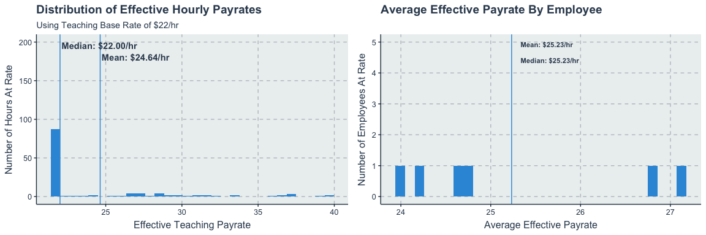

### Paramedic Skills Instructor

**Target pay rate for Paramedic Skills Instructor:** $30 /hr.
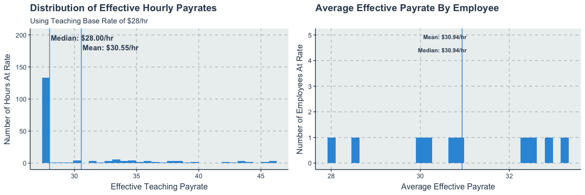

### Adjunct Faculty

**Target pay rate for Adjunct Faculty**: $38 /hr.
 ##
Effects on Field Overtime Pay If an employee works several hours
teaching, and then follows this with field shifts later in the week,
they will see a different overtime rate for those field shifts than they
would have with just field hours. This change in overtime premium pay
would affect the employee’s overall earnings. The following set of
analyses identifies what the change in overtime premium would be.

### CPR Instructor

**Target pay rate for CPR Instructor:** $20 /hr.
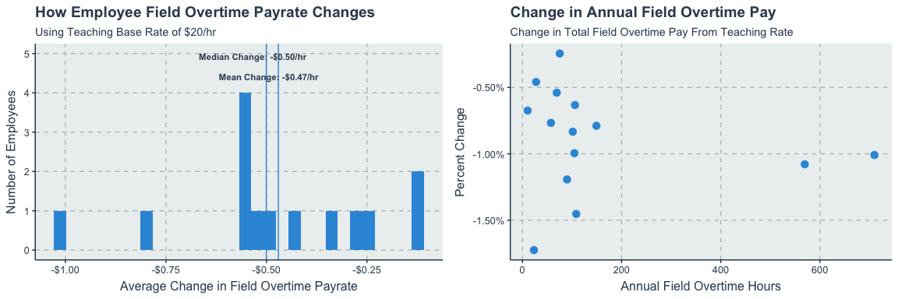

### CE Instructor

**Target pay rate for CE Instructor:** $25 /hr.
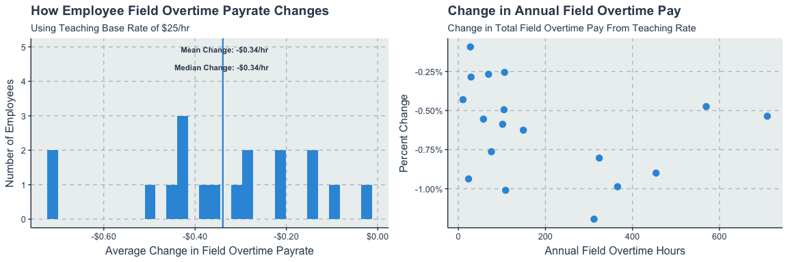 ##\# EMT
Skills Instructor **Target pay rate for EMT Skills Instructor:** $25/hr.
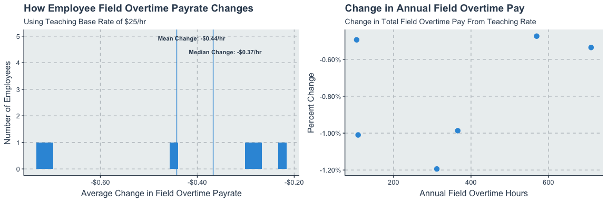

### Paramedic Skills Instructor

**Target pay rate for Paramedic Skills Instructor:** $30 /hr.
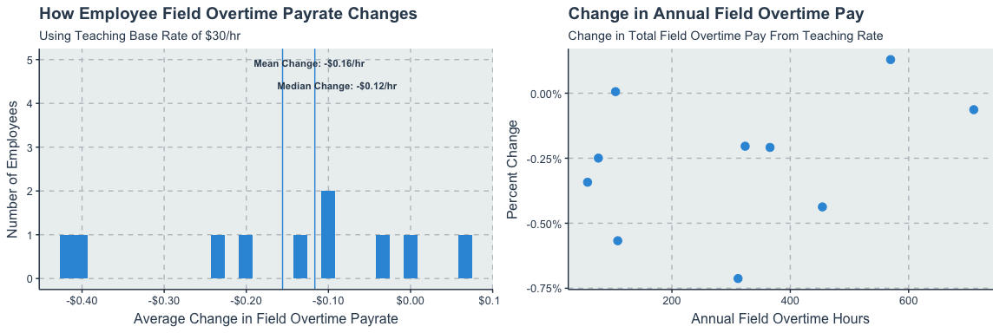

### Adjunct Faculty

**Target pay rate for Adjunct Faculty**: $38 /hr.
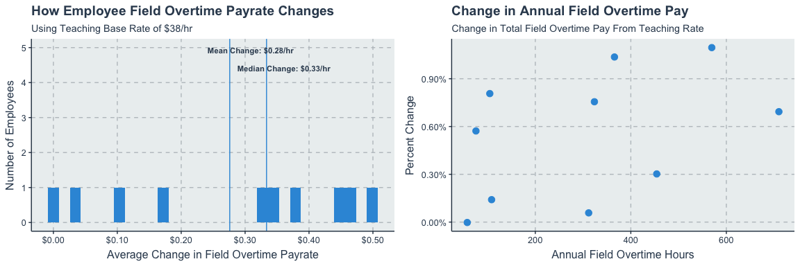

## Pay Rate Analysis (Using Total Overtime, probably incorrect)

An alternate calculation can be made by looking at all teaching hours as
overtime if the employee has at least 40 hours of field work in the
week. With this approach, all teaching time is considered overtime,
regardless of when in the week it was worked.

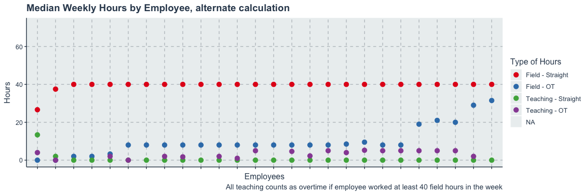

### CPR Instructor

**Target pay rate for CPR Instructor:** $20 /hr.
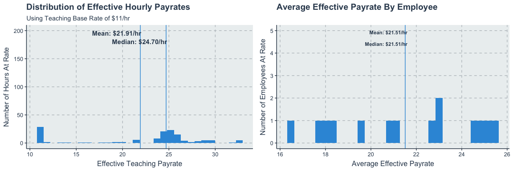

### CE Instructor

**Target pay rate for CE Instructor:** $25 /hr.
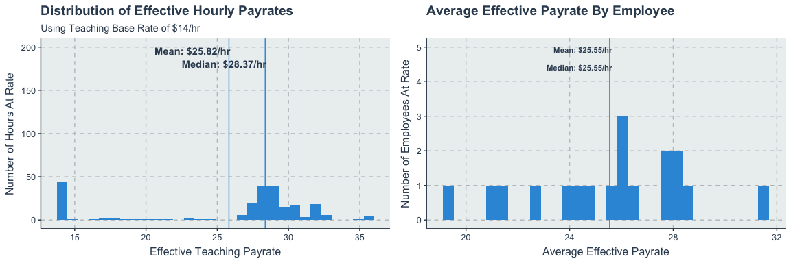 ##\# EMT
Skills Instructor **Target pay rate for EMT Skills Instructor:** $25/hr.
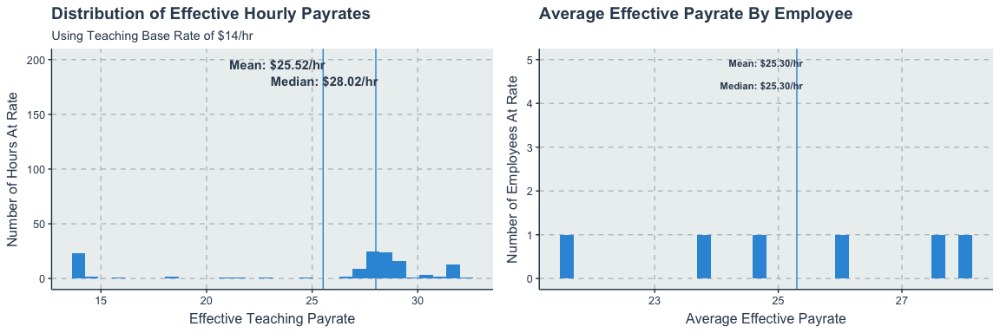

### Paramedic Skills Instructor

**Target pay rate for Paramedic Skills Instructor:** $30 /hr.
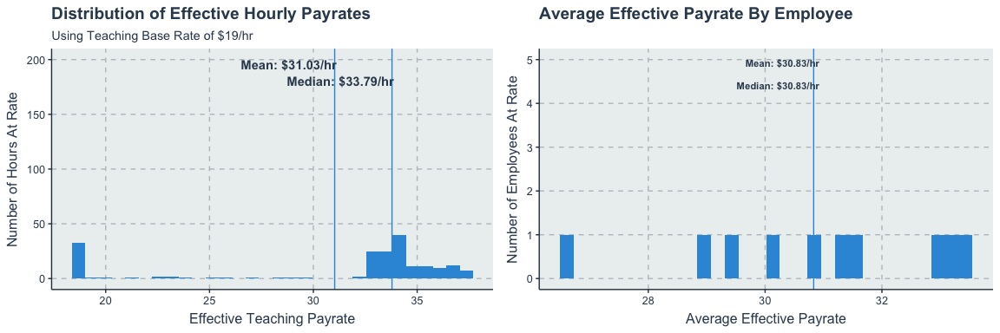

### Adjunct Faculty

**Target pay rate for Adjunct Faculty**: $38 /hr.
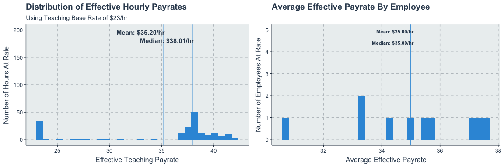
